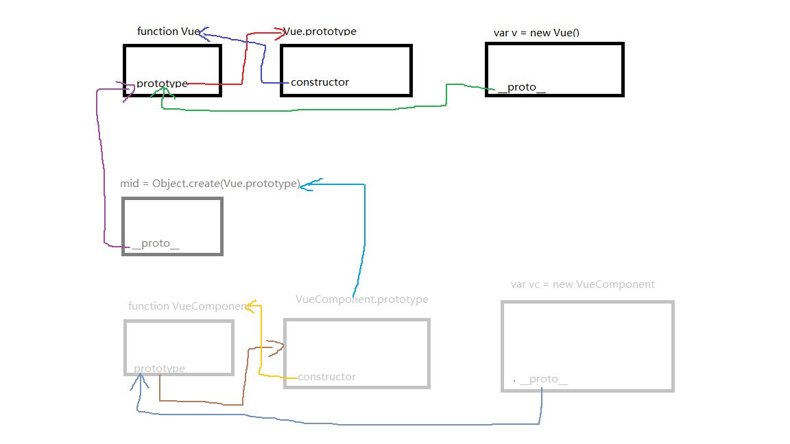

# VueComponent

## Vue 和 VueComponent

这俩是父子类的关系，VueComponent是Vue的子类，在`core/global-api/extend.js`里实现了继承

```js
// extend.js
export function initExtend (Vue: GlobalAPI) {
  /**
   * Each instance constructor, including Vue, has a unique
   * cid. This enables us to create wrapped "child
   * constructors" for prototypal inheritance and cache them.
   */
  Vue.cid = 0
  let cid = 1

  /**
   * Class inheritance
   */
  Vue.extend = function (extendOptions: Object): Function {
    extendOptions = extendOptions || {}
    // this就是Vue
    const Super = this
    const SuperId = Super.cid
    // 如果已经继承过了，那就可以直接返回了
    const cachedCtors = extendOptions._Ctor || (extendOptions._Ctor = {})
    if (cachedCtors[SuperId]) {
      return cachedCtors[SuperId]
    }

    const name = extendOptions.name || Super.options.name
    if (process.env.NODE_ENV !== 'production' && name) {
      validateComponentName(name)
    }
    // 这就是为啥说VueComponent就是Vue了
    // VueComponent在这
    const Sub = function VueComponent (options) {
      this._init(options)
    }
    // VueComponent继承Vue.prototype的属性和方法，并重新将constructor指回VueComponent，这样VueComponent既是Vue，也有自己特定的类型
    Sub.prototype = Object.create(Super.prototype)
    Sub.prototype.constructor = Sub
    Sub.cid = cid++
    Sub.options = mergeOptions(
      Super.options,
      extendOptions
    )
    Sub['super'] = Super

    // For props and computed properties, we define the proxy getters on
    // the Vue instances at extension time, on the extended prototype. This
    // avoids Object.defineProperty calls for each instance created.
    if (Sub.options.props) {
      initProps(Sub)
    }
    if (Sub.options.computed) {
      initComputed(Sub)
    }

    // allow further extension/mixin/plugin usage
    Sub.extend = Super.extend
    Sub.mixin = Super.mixin
    Sub.use = Super.use

    // create asset registers, so extended classes
    // can have their private assets too.
    ASSET_TYPES.forEach(function (type) {
      Sub[type] = Super[type]
    })
    // enable recursive self-lookup
    if (name) {
      Sub.options.components[name] = Sub
    }

    // keep a reference to the super options at extension time.
    // later at instantiation we can check if Super's options have
    // been updated.
    Sub.superOptions = Super.options
    Sub.extendOptions = extendOptions
    Sub.sealedOptions = extend({}, Sub.options)

    // cache constructor
    cachedCtors[SuperId] = Sub
    return Sub
  }
}

function initProps (Comp) {
  const props = Comp.options.props
  for (const key in props) {
    proxy(Comp.prototype, `_props`, key)
  }
}

function initComputed (Comp) {
  const computed = Comp.options.computed
  for (const key in computed) {
    defineComputed(Comp.prototype, key, computed[key])
  }
}
```

经过上面的处理，`VueComponent`继承了`Vue`的属性和方法。`Sub.prototype = Object.create(Super.prototype); Sub.prototype.constructor = Sub`这两句就是精髓，实现的继承关系就是下图。




## computed属性

在`initComputed`里就是对`Comp`上带有的`computed`方法，挨个进行定义，在`Comp.prototype`上对每个`key`都有对应的取值方法，所以在`.vue`的组件里可以`this.someProperty`这样直接访问`computed`定义的"属性".

其中用到的`defineComputed`在`core/instance/state.js`里定义

```js
export function defineComputed (
  target: any,
  key: string,
  userDef: Object | Function
) {
  const shouldCache = !isServerRendering()
  if (typeof userDef === 'function') {
    sharedPropertyDefinition.get = shouldCache
      ? createComputedGetter(key)
      : createGetterInvoker(userDef)
    sharedPropertyDefinition.set = noop
  } else {
    sharedPropertyDefinition.get = userDef.get
      ? shouldCache && userDef.cache !== false
        ? createComputedGetter(key)
        : createGetterInvoker(userDef.get)
      : noop
    sharedPropertyDefinition.set = userDef.set || noop
  }
  if (process.env.NODE_ENV !== 'production' &&
      sharedPropertyDefinition.set === noop) {
        // 如果computed里key对应的value是个对象，且没有设置set方法，那在dev模式下会报错
    sharedPropertyDefinition.set = function () {
      warn(
        `Computed property "${key}" was assigned to but it has no setter.`,
        this
      )
    }
  }
  // target会是一个 Cls.prototype，这样在原型上定义了key对应的计算属性，实例读取值的时候就可以 this.someComputedProperty 这样使用。
  Object.defineProperty(target, key, sharedPropertyDefinition)
}

function createComputedGetter (key) {
  return function computedGetter () {
    const watcher = this._computedWatchers && this._computedWatchers[key]
    if (watcher) {
      if (watcher.dirty) {
        watcher.evaluate()
      }
      if (Dep.target) {
        watcher.depend()
      }
      return watcher.value
    }
  }
}

function createGetterInvoker(fn) {
  return function computedGetter () {
    return fn.call(this, this)
  }
}
```

从上面就可以看出，为啥说`computed`定义的属性是可以被缓存的，`computed`里属性的写法为啥可以是`function`，也可以是`Object`，并且如何手动地设置成不使用缓存（使用对象形式去定义，并且设置`cache`为`false`）,框架默认认为不是服务端渲染就需要缓存起来。

为啥会缓存？其实不是说它把值放在某个地方存下来，而是创建了`Watcher`，让`watcher`去观察它依赖的属性有没有变化，如果有变化，`watcher`会重新`evaluate`，如果没有`watcher`或者`watcher`觉得没有变化，那就不会重新计算，返回的就是`watcher`之前的`value`